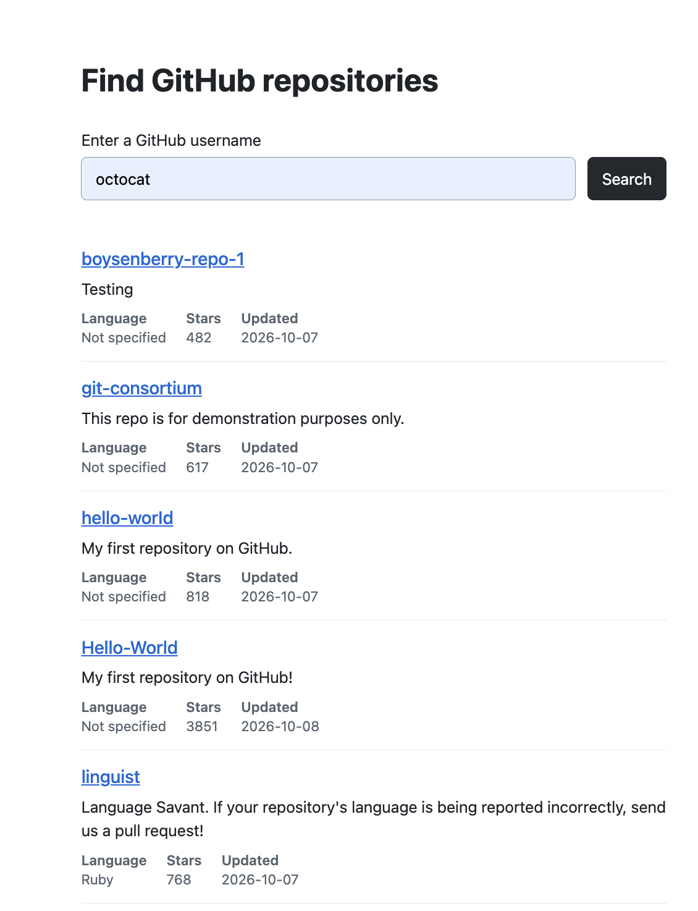
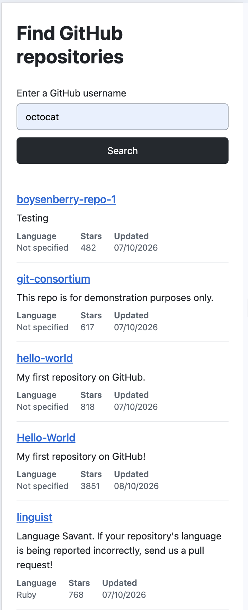

# GitHub repository search

Search by GitHub username to view public repositories.

Enter a username to see repository names linked to GitHub, descriptions, languages, star counts and updated dates. Results appear without leaving the page.

## Preview

### Desktop



### Mobile



## Run locally

Requirements:

- Ruby 4.0.7
- Bundler

Clone the repository and set it up:

```sh
git clone git@github.com:johnnybutler7/github-repository-search.git
cd github-repository-search
bin/setup --skip-server
bin/dev
```

The app uses SQLite, so no separate database server is required. Open [http://localhost:3000](http://localhost:3000) after starting the server.

## Run checks

```sh
bin/rails test
bin/rails test:system
bin/ci
```

System tests use headless Chrome and require Chrome. `bin/ci` runs the configured style, security and test checks. WebMock stubs GitHub requests so the tests do not depend on the live API.

## Technical decisions

The app uses conventional Rails with Stimulus rather than a separate frontend framework. Plain CSS handles the responsive layout.

The Stimulus frontend calls `/api/repositories` with the username. The Rails API controller calls `GithubClient`, which requests public repositories from the GitHub REST API. The API returns only the repository fields used by the UI.

`GithubClient` is a small Ruby class using `Net::HTTP`, with five-second open and read timeouts. A GitHub 404 is handled as a missing user. Other unsuccessful GitHub HTTP responses show a general error.

## Current limits

- GitHub requests use no authentication and are subject to GitHub's unauthenticated rate limit.
- Each search fetches only the first 100 repositories, with no pagination.
- The app does not persist searches or repository data.
